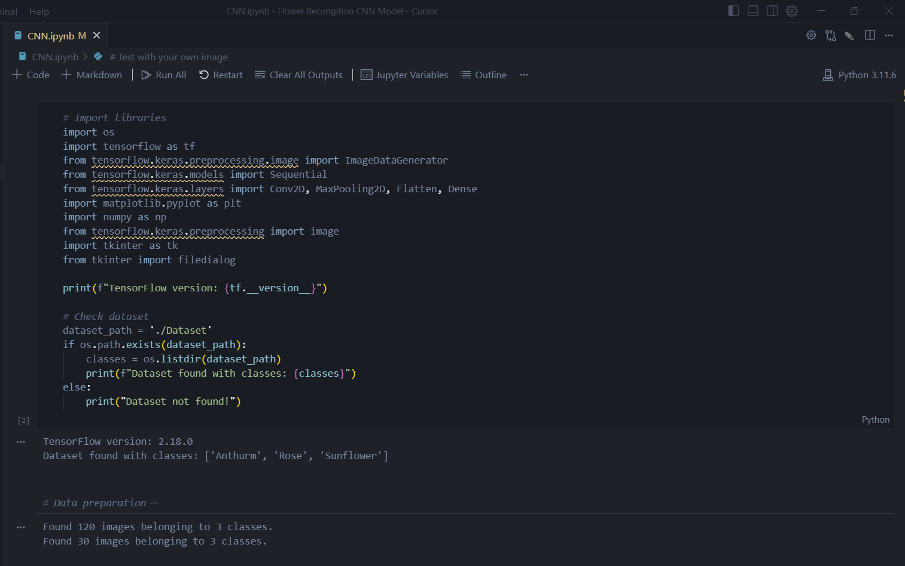
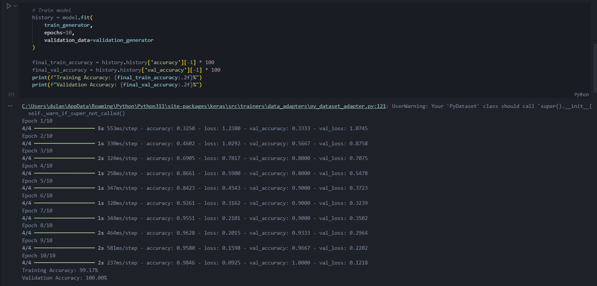
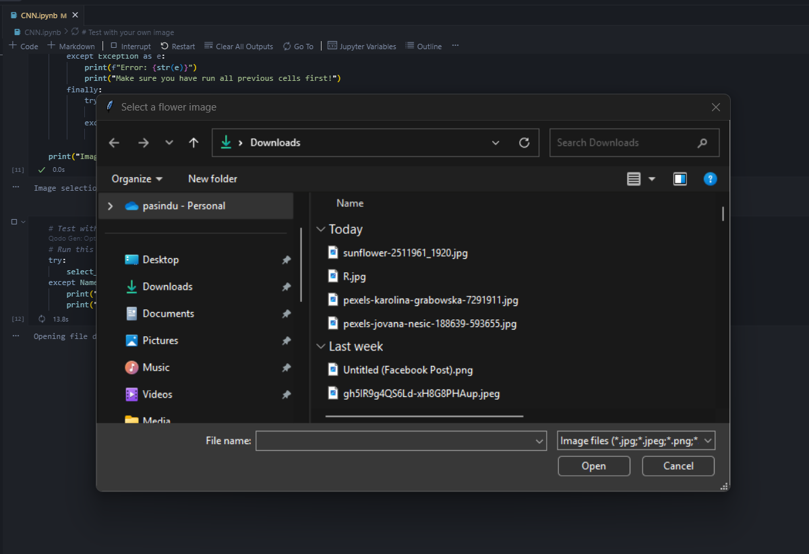
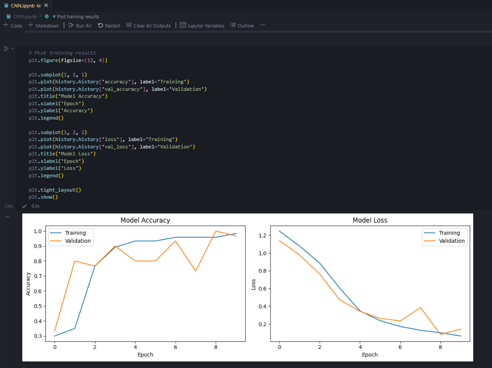
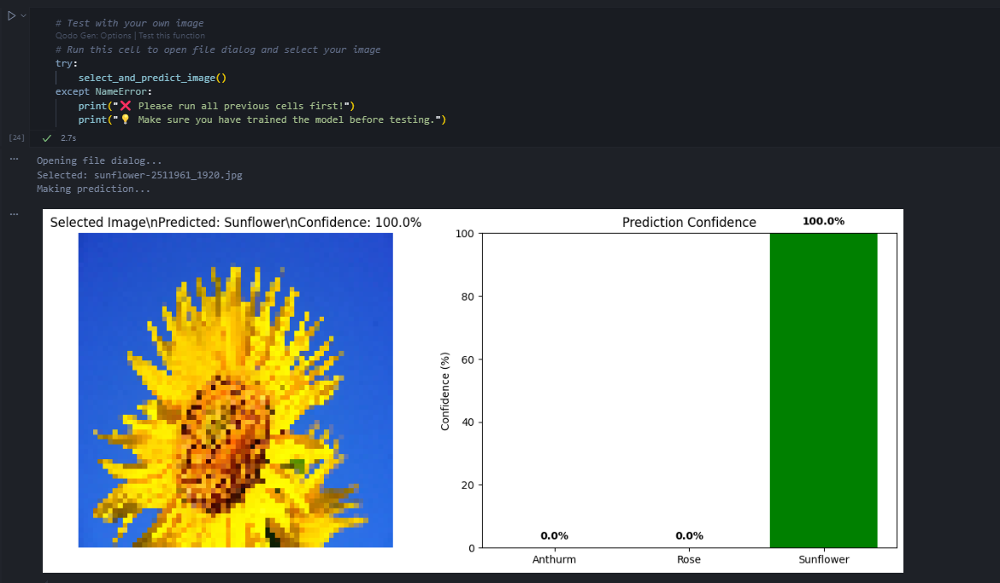

# 🌺 Flower Classification CNN - Simple Version

A clean, simple CNN for classifying flower images. Focus on **image selection testing only**.


*Complete flower classification system with interactive testing*

## 📁 Files

```
├── CNN.ipynb                    # Clean Jupyter notebook (8 cells)
├── flower_classifier_final.py  # Complete Python script
├── test_image_selection.py     # Test file dialog
├── Dataset/                     # Image dataset
│   ├── Anthurm/                # 50 images
│   ├── Rose/                   # 50 images
│   └── Sunflower/              # 50 images
├── screenshots/                 # Documentation images
│   ├── 01_project_overview.png
│   ├── 02_training_process.png
│   ├── 03_file_selection.png
│   ├── 04_prediction_results.png
│   └── 05_accuracy_graphs.png
```

## 🚀 Quick Start

### Option 1: Jupyter Notebook (Recommended)

1. Open `CNN.ipynb` in VS Code
2. Run cells 1-8 sequentially (`Shift+Enter`)
3. Cell 8 opens file dialog to select your image


*Model training in progress showing accuracy improvements*

### Option 2: Complete Python Script

```bash
python flower_classifier_final.py
```

### Option 3: Test File Dialog Only

```bash
python test_image_selection.py
```


*Interactive file dialog for selecting flower images*

## 📚 Notebook Structure

The `CNN.ipynb` notebook contains 9 cells:

### 🔧 **Cell 1: Setup & Dataset Check**
- Imports all required libraries
- Checks dataset availability
- Shows dataset statistics

### 📊 **Cell 2: Data Preparation**
- Sets up data generators
- Configures image preprocessing
- Splits data into training/validation

### 🏗️ **Cell 3: Model Architecture**
- Builds CNN model with:
  - 2 Convolutional layers
  - 2 MaxPooling layers
  - Dense layers for classification

### 🎯 **Cell 4: Model Training**
- Trains the model for 10 epochs
- Shows training progress
- Displays final accuracy

### 💾 **Cell 5: Save Model**
- Saves trained model as `flower_classifier_model.h5`
- Extracts class names for testing

### 📈 **Cell 6: Training Visualization**
- Plots training/validation accuracy
- Plots training/validation loss
- Shows training summary


*Training and validation accuracy/loss curves showing model performance*

### 🛠️ **Cell 7: Image Selection Function**
- Defines interactive testing function
- File dialog for image selection
- Results visualization

### 🧪 **Cell 8: Test Your Image**
- Execute prediction function
- Select and classify your own images

## 🎯 Features

### ✨ **Interactive Testing Options**

1. **📁 File Selection**: Choose your own images using a file dialog

### 🔍 **Detailed Results**

- **Confidence scores** for all classes
- **Visual display** of images with predictions
- **Side-by-side visualization** with confidence bars


*Example prediction showing selected image and confidence scores for all flower classes*

### 🛡️ **Error Handling**

- Checks for missing dependencies
- Validates dataset structure
- Handles invalid image files
- User-friendly error messages

## 📋 Requirements

- **Python 3.7+**
- **TensorFlow 2.x**
- **Matplotlib**
- **NumPy**
- **Scikit-learn** (for evaluation metrics)
- **Seaborn** (for confusion matrix)
- **Tkinter** (for file dialog - usually included with Python)

## 🎨 Model Architecture

```
Input (64x64x3)
    ↓
Conv2D (32 filters, 3x3) + ReLU
    ↓
MaxPooling2D (2x2)
    ↓
Conv2D (64 filters, 3x3) + ReLU
    ↓
MaxPooling2D (2x2)
    ↓
Flatten
    ↓
Dense (128 units) + ReLU
    ↓
Dense (3 units) + Softmax
    ↓
Output (3 classes)
```

## 📊 Expected Results

- **Training Accuracy**: ~98-100%
- **Validation Accuracy**: ~93-97%
- **Training Time**: 1-2 minutes (10 epochs)
- **Model Size**: ~1.5MB

## 🔧 Troubleshooting

### Common Issues:

1. **"Dataset not found"**
   - Ensure `Dataset` folder is in the same directory
   - Check folder structure matches the expected format

2. **"Import Error"**
   - Install missing packages: `pip install tensorflow matplotlib numpy scikit-learn seaborn`

3. **"Kernel not found"**
   - Install Jupyter extension in VS Code
   - Select the correct Python interpreter

4. **"File dialog not opening"**
   - Tkinter might not be installed: `pip install tk`

## 🎯 Usage Tips

1. **Run cells in order** - Each cell depends on previous ones
2. **Wait for training** - Cell 4 takes 1-2 minutes to complete
3. **Test with your images** - Use Cell 9 to test with your own flower photos
4. **Check accuracy** - Use Cell 6 to see detailed performance metrics

## 🌟 Next Steps

- Add more flower classes
- Implement data augmentation
- Try transfer learning with pre-trained models
- Deploy as a web application
- Add real-time camera classification

---

**Happy Flower Classification! 🌺🤖**
